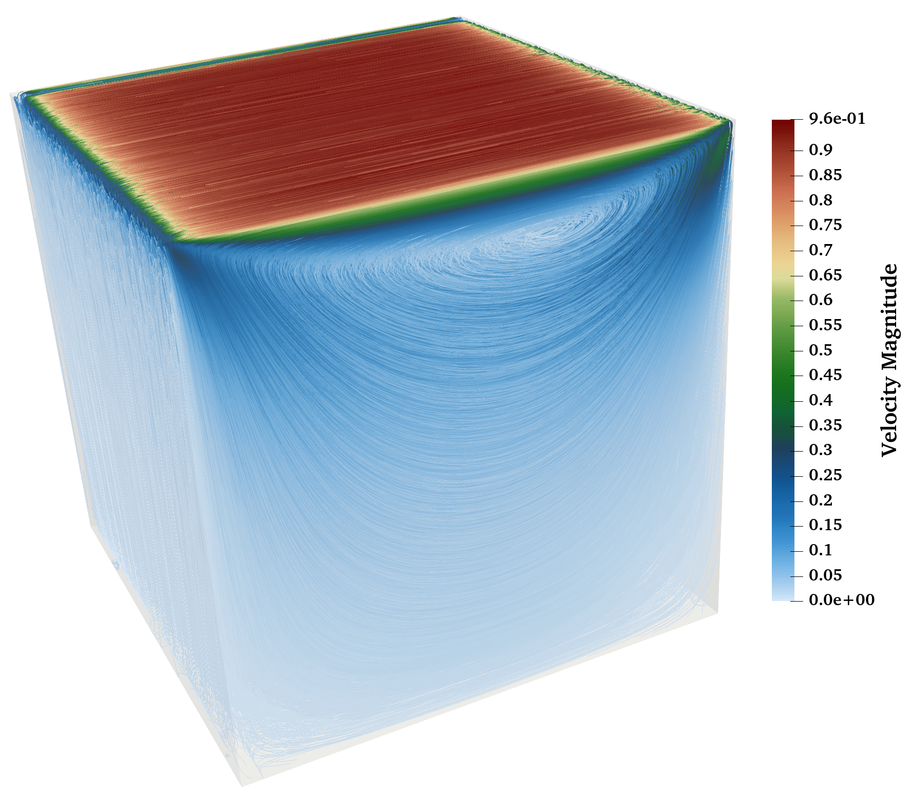

# LidDrivenCavity3DParallel

## Elegant Fluid Dynamics Simulation in Java

Welcome to LidDrivenCavity3DParallel, a sophisticated parallel implementation of the classic 3D lid-driven cavity flow problem. This project harnesses the power of Java's concurrency to deliver high-performance computational fluid dynamics (CFD) simulations.

### 🌊 About the Project

The lid-driven cavity is a fundamental problem in fluid dynamics, serving as a benchmark for numerical methods and a stepping stone to understanding more complex fluid flows. This implementation takes the classic 2D problem into the third dimension, offering a more comprehensive and realistic simulation of fluid behavior.

Our solution employs:
- Finite Volume Method (FVM) with a staggered grid
- Parallel processing for enhanced performance
- 3D visualization capabilities

### 🚀 Features

- **3D Simulation**: Full three-dimensional modeling of fluid dynamics
- **Parallel Processing**: Utilizes Java's Fork/Join framework for efficient multi-core execution
- **Staggered Grid**: Ensures stability and accuracy in pressure-velocity coupling
- **VTK Output**: Generates VTK files for easy visualization in popular scientific visualization tools

### 🛠 Prerequisites

- Java 17 LTS or higher
- Basic understanding of fluid dynamics and numerical methods (optional, but enhances appreciation of the simulation)

### 💻 Running the Simulation

1. Clone this repository:
   git clone https://github.com/sohrabsarabian/CFDParallelJava3D.git
2. Navigate to the project directory:
   cd CFDParallelJava3D
3. Run the simulation, specifying the number of processors:
   java LidDrivenCavity3DParallel.java <np>
Replace `<np>` with the number of processors you want to use.

### 🖼 Visualization

The simulation outputs a VTK file which can be visualized using tools like ParaView or VisIt. This allows for stunning 3D renderings of the fluid flow, pressure fields, and velocity streamlines.

### 🧪 Physics Behind the Simulation

The lid-driven cavity problem simulates fluid in a cubic cavity with the top wall moving at a constant velocity. This creates a complex flow pattern with primary and secondary vortices. Key physical concepts involved include:

- Reynolds number (Re) dependent flow regimes
- Momentum transfer and viscous effects
- Pressure-velocity coupling in incompressible flows

### 🤝 Contributing

Contributions, issues, and feature requests are welcome! Feel free to check [issues page](https://github.com/sohrabsarabian/CFDParallelJava3D/issues) if you want to contribute.

### 📜 License

This project is licensed under the GNU General Public License (GPL)

### 📬 Contact

Sohrab Sarabian - [ms322615@ohio.edu or https://msarabian.com/]

Project Link: [https://github.com/sohrabsarabian/CFDParallelJava3D](https://github.com/sohrabsarabian/CFDParallelJava3D)

---

"In every walk with nature, one receives far more than he seeks." - John Muir

Dive into the mesmerizing world of fluid dynamics with LidDrivenCavity3DParallel!
